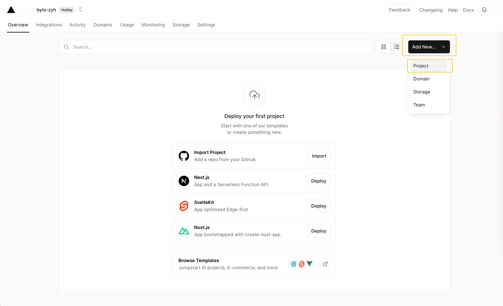

+++
title = 'Rss订阅'
date = 2023-10-12T09:40:01+08:00
draft = false
categories = ["数字生活"]
tags = ["rss"]
toc = true
+++

## 简介

RSS(Really Simple Syndication,简单信息聚合)。其作用为通过XML将信息进行聚合展示，在当下的作用为：

- **无缺失地收集信息** ：所有信息订阅的信息都可以在RSS阅读器中查看，例如收集微博、知乎、哔哩哔哩等软件的更新，还可以根据自定义规则收集网页信息，例如网站的通知公告、博客等。
- **集中地收集信息** : 可以将信息都收集在RSS阅读器中集中阅读，而无须跳转到对应软件阅读。
  

或许在某些网站上见到过这个图标，这就是RSS的图标，表示该网站提供了RSS订阅。

## RSS 软件

<iframe src="//player.bilibili.com/player.html?aid=58398648&bvid=BV194411F7LV&cid=101860197&p=1" scrolling="no" border="0" frameborder="no" framespacing="0" allowfullscreen="true" align="right"> </iframe>

RSS软件有多种选择，例如inoreader，reeder 5 等，我在用的是inoreader,可以查看侧边的视频对rss和inoreader有一个大致的了解，也可以查看其[中文官网](https://www.innoreader.com/zh-hans/)进行了解。

我个人选择 inoreader 是因为：

- 自定义通知规则：根据不同规则发送自定义通知
- 过滤订阅源：根据关键词过滤订阅源内容
- 自定义网页监视：监视未提供rss服务的网页变化

不过inoreader的订阅$99/年或者$10/月，如果不需要上述功能可以选择 reeder5（不过reeder5连通知功能都没有）或者其他的rss阅读软件。

## 获得RSS订阅源-RSSHub

rss阅读器都需要rss源来进行订阅，一个rss源是一个类似于 `https://bytx-zyh.github.io//index.xml` 的xml链接。

如果网页支持rss的话，可以使用rss插件[RSSHub-Radar](https://github.com/DIYgod/RSSHub-Radar)来检测，如果其有可用的rss订阅就可以复制并自动添加到rss阅读器中。也可以查看网页上是否有rss字样或者rss的logo，通常是指向rss源的超链接。

对于一些没有提供rss服务的网站，可以使用 RSSHUB 为其创建 rss 源。
RSSHUB的官方文档为：[https://docs.rsshub.app](https://docs.rsshub.app/)，建议首先阅读其**指南**部分，而**路由**部分表示的是RSSHUB已提供的服务，例如哔哩哔哩、微博、知乎的规则等，也可以与指南提供的浏览器插件 RSSHub-Radar 配合使用。

### 自建RSSHUB

查看RSSHUB指南的路由部分，可以发现常见路由都有**严格反爬**，故建议自建RSSHUB服务以便于使用，如果有服务器可以考虑使用[Docker自建](https://docs.rsshub.app/install/#docker-jing-xiang)。

如果没有服务器推荐使用****Vercel****部署，RSSHUB官方文档位于[此处](https://docs.rsshub.app/install/#bu-shu-dao-vercel-zeit-now)。

前往[Vercel](https://vercel.com/new)官网进行注册登录，可以直接选择使用GitHub登录，而后根据其提示注册账户。

在GitHub [fork](https://github.com/DIYgod/RSSHub/fork) https://github.com/DIYgod/RSSHub 仓库到当前GitHub账户，而后前往Vercel主页，导入RSSHUB仓库（需要GitHub授予访问权限）并进行部署。

### 查看部署结果

部署完成后，点击进入RSSHub项目，给出的`domains`网址即部署完成后的项目网址，使用该网址替换RSSHub中的域名即可，即使用该网址拼接路由。（通常可以直接使用插件 RSSHub-Radar 获得完整rss源链接）

如果需要绑定自定义域名，可以前往 `settings-domains` 进行修改，注意需要前往域名服务商增加解析规则。

一般而言vercel免费账户即可足够使用，具体不同账户的限制可以查看[此处](https://vercel.com/docs/concepts/limits/overview)。

## rss 源推荐

- 社交网络
  哔哩哔哩，微博，知乎等
- 音乐软件
  网易云等
- GitHub
- 社科人文
- 图片